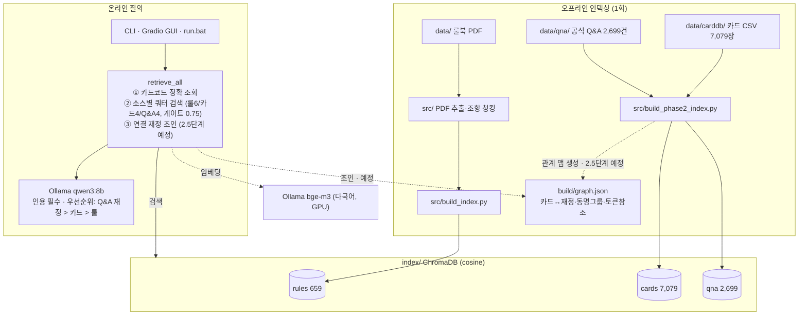

# sve_rag_judge

Shadowverse Evolve 룰 저지 — 일본어 종합 룰북을 RAG로 검색해, 한국어 질문에 룰 번호를 인용하며 답변하는 로컬 도구입니다. 전부 무료/로컬(Ollama + ChromaDB)로 동작합니다.

## 프로젝트 구조

```
data/       입력 데이터 (git 추적)
  ShadowverseEVOLVE_cr_1.26.1_260609.pdf   종합 룰북 원본 (일본어)
  carddb/   카드 DB CSV (BP/CP 세트별) — 2단계용
  qna/      공식 Q&A 수집 데이터 (JSONL) — 2단계용
src/        전체 파이프라인 (PDF 추출 → 청킹 → 인덱싱 → 질의 CLI/GUI)
tests/      pytest 단위 테스트
docs/       설계 스펙과 구현 계획
build/      재생성 가능한 중간 산출물 (gitignore)
index/      ChromaDB 벡터 인덱스 (gitignore)
```

## 아키텍처



## 설치

사전 준비: [Ollama](https://ollama.com) 설치 후 모델 다운로드

```bash
ollama pull bge-m3 && ollama pull qwen3:8b
pip install -r requirements.txt
```

## 판정 저지 사용법

```bash
# 1회 인덱싱 (PDF 추출 → 조항 청킹 → 임베딩)
python src/batch_pdf_to_json.py data build/raw_json
python src/postprocess_pdf_json.py build/raw_json build/processed
python -m src.chunk_rules build/processed/ShadowverseEVOLVE_cr_1.26.1_260609.txt build/chunks.jsonl
python -m src.build_index build/chunks.jsonl
python -m src.build_phase2_index

# 질의 (대화형 CLI)
python -m src.judge_cli
```

모든 답변은 `[룰 X.X.X]` / `[카드 코드 이름]` / `[Q&A ID]` 형식으로 근거를 인용하며, 근거를 찾지 못하면 그렇게 말합니다. 근거 충돌 시 공식 Q&A 재정 > 카드 텍스트 > 종합 룰 순으로 우선합니다. 인덱스 경로는 실행 위치와 무관하게 리포 루트의 `index/`로 고정됩니다.

CPU 환경에서는 답변 생성에 1~3분 걸릴 수 있습니다. 다른 LLM을 쓰려면 `--llm` 옵션을 사용하세요 (예: `--llm qwen3:4b`).

## 테스트

```bash
python -m pytest -v
```

## 추출 스크립트 단독 사용

`src/`의 두 추출 스크립트는 범용 PDF → 텍스트 도구로 단독 사용할 수 있습니다.

```bash
python src/batch_pdf_to_json.py <input_dir> <output_dir> [--recursive] [--quiet]
python src/postprocess_pdf_json.py <input_dir> <output_dir> [--recursive]
```

`src/postprocess_pdf_json.py`의 `collect_text_by_page` 함수는 `opendataloader_pdf`의 JSON 트리 구조(`kids`, `list items`, `content`, `page number`)에 의존합니다. 업스트림 스키마가 바뀌면 이 함수를 먼저 확인하세요.

## 로드맵

- 1단계 (완료): 종합 룰북 기반 룰 Q&A CLI
- 2단계 (완료): 카드 DB(7,079장) + 공식 Q&A(2,699건) 종합 판정 저지
- 3단계 (예정): 한↔일 카드명 매핑, 대화 히스토리, 웹/메신저 배포
