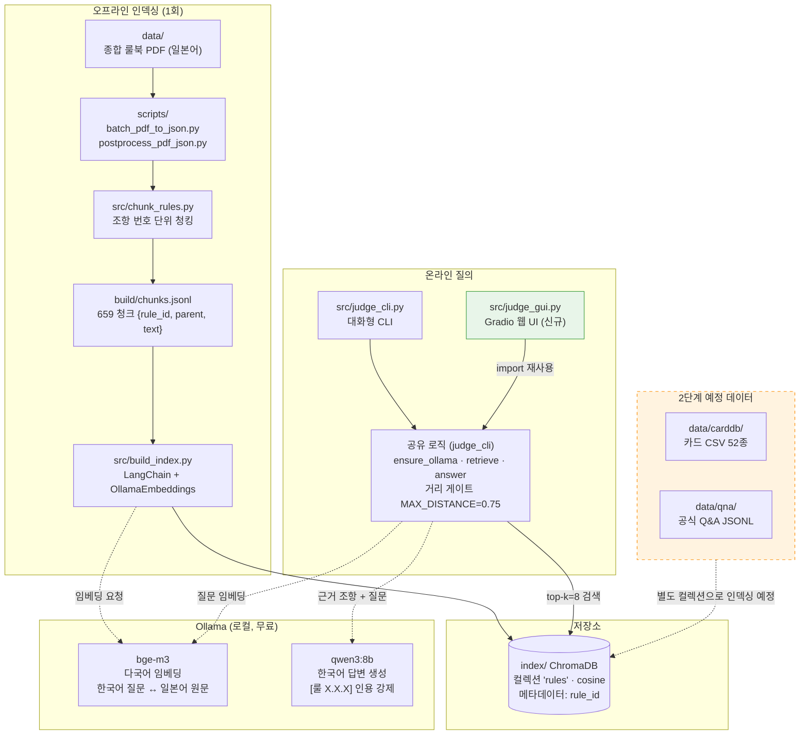

# sve_rag_judge 아키텍처

## 답변 흐름 요약

1. 사용자 질문(한국어) → bge-m3 임베딩 → ChromaDB top-8 검색
2. 거리 ≤ 0.75인 조항이 없으면 LLM 호출 없이 "관련 조항을 찾지 못했습니다" (환각 1차 방어)
3. 통과 조항만 프롬프트에 실어 qwen3:8b 호출 — 인용 필수, 근거 부족 시 "룰북에서 근거를 찾지 못했습니다" (2차 방어)
4. 답변 + 참조 조항 원문 표시 (사용자 직접 검증)
